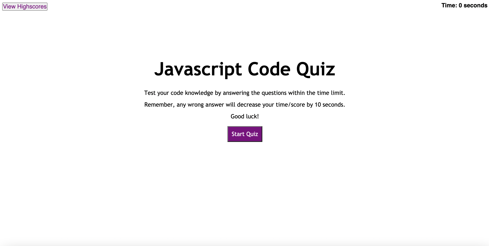

# Code-Quiz

This webpage is a multiple choice quiz that begins once the "Start" button is clicked. Individual questions are showed giving the user immediate feedback. A timer represents not only time but the score as well. Highscores are recorded with a chance to view all at once by selecting "View Highscores".

# Features and Functionality

Below is a visualization of the webpage.

View video here: https://watch.screencastify.com/v/BL5mtSX8OvktTWFSrBfa (Note: An alert window pops up when hitting View Scores button. Screencastify cannot capture when video is filmed for just the specific window.)

The quiz begins once the user clicks on the "Start Quiz" button. Questions are displayed one at a time once the user selects an answer. A response to the selection is shown telling the user if they chose the correct answer. The quiz has a time/score limit of 75 seconds. The timer decreases upon the click of the "Start Quiz" button. It will also decrease by 10 seconds if the answer is incorrect. The quiz ends once the user has finished answering all questions or time is up. The user then has a chance to record his or her score at the end by an input of the appropriate initials. Values are stored for viewing by clicking "View Highscores". An alert box pops up in the window to show.

# Deployment Access

https://cianfich1016.github.io/Code-Quiz/
# License

https://github.com/cianfich1016/Code-Quiz